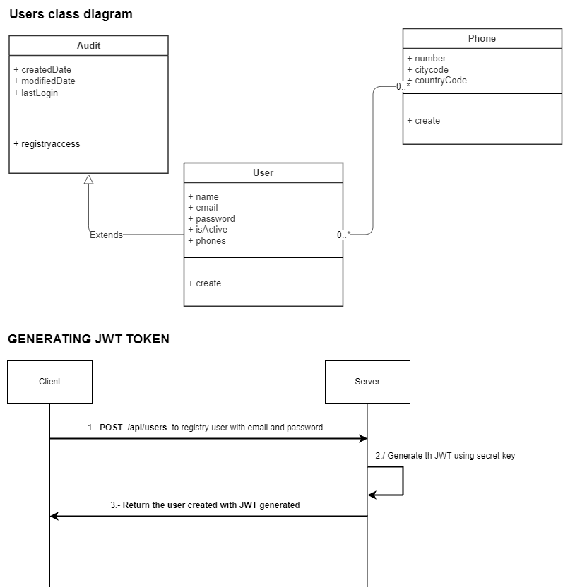

# REST API to create Users and generating a JWT token

## Features
* End-point to User registration and generating JWT token
* 

## Technologies
* Spring Boot 3.0
* Spring Security
* JSON Web Tokens (JWT)
* Maven
* Swagger
* lombock library
* Junit

## Getting Started

To build and run the project, follow these steps:

* Clone the repository: `git clone https://github.com/jsandovalz/registry-users.git`
* Navigate to the project directory: cd registry-users
* Build the project: mvn clean install
* Run the project: mvn spring-boot:run

-> The application will be available at http://localhost:8080.

-> The swagger documentation available at http://localhost:8080/swagger-ui.html

-> The flow alredy is available into registry-users\src\main\resources\diagrama.pdf

